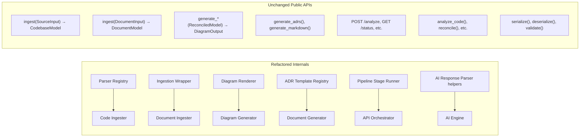

# Design Document: Architectural Reverse Engineer – KISS/DRY Refactoring

## Overview

This refactoring applies KISS and DRY principles to the existing Architectural Reverse Engineer backend. The goal is to eliminate duplicated logic, simplify overly complex abstractions, and extract shared patterns into reusable utilities — all while preserving every public API signature, response schema, and existing test.

The refactoring targets nine specific areas across six modules (`code_ingester`, `document_ingester`, `diagram_generator`, `document_generator`, `api`, `ai_engine`, `serializer`). No new features are added; the external behavior is identical before and after.

### Refactoring Strategy

Each change follows the same pattern:
1. Identify the repeated/complex code
2. Extract a shared utility (registry, helper, wrapper)
3. Replace all call sites with the shared utility
4. Verify behavioral equivalence via existing + new tests

## Architecture

The overall system architecture remains unchanged. The refactoring only affects internal module structure:



### Key Design Decisions

1. **Callable-registry for parsers over pure-data config**: Language parsing rules are registered as callable functions in a typed registry. The existing parsers have stateful logic (Python's `__all__` check, Java's `;` stripping) that cannot be captured by regex patterns alone. The DRY win is the typed registry lookup and removal of `_parse_generic`, not forcing all parsers into a single data structure.
2. **Decorator/wrapper for ingestion errors**: A single `_safe_ingest` wrapper replaces three separate try/except blocks in `document_ingester`, ensuring consistent `FileReadError` detail structure.
3. **Shared Graphviz/PlantUML render helpers**: The repeated pattern of "build graph → render → catch errors → wrap in DiagramOutput" is extracted into two helpers (`_render_graphviz`, `_render_plantuml_diagram`).
4. **Unified ADR template registry**: Three separate dicts (`_PATTERN_ADR_MAP`, `_ELEMENT_TYPE_ADR_MAP`, `_LAYER_ADR_MAP`) are merged into one `_ADR_TEMPLATE_REGISTRY` keyed by `(category, match_key)`.
5. **Pipeline stage runner**: The repeated `try: ... except AnalyzerError: non_fatal.append(...)` pattern is extracted into two helpers: `_run_stage` for single callables and `_run_stage_map` for the list-iteration-with-error-collection pattern.
6. **Shared Element/Relationship extractors**: `_extract_elements(data)` and `_extract_relationships(data)` replace duplicated list comprehensions across `_parse_analysis_result`, `_parse_reconciled_model`, and `_parse_classified_elements`.
7. **Recursive `_has_bytes_fields`**: The shallow check is replaced with a fully recursive traversal.
8. **Simplified cycle detection**: Redundant `_can_reach` reachability checks are eliminated by deriving cycle membership directly from DFS state.

## Components and Interfaces

### 1. Parser Registry (`code_ingester` internal)

**Current state**: Four separate functions (`_parse_python`, `_parse_js_ts`, `_parse_java`, `_parse_generic`) with similar structure — iterate lines, match regex patterns, collect imports/exports/interfaces. A `_PARSERS` dict maps language strings to these functions, but the dict is untyped (`dict[str, object]`) and the dispatch in `_parse_file` uses a fallback to `_parse_generic`.

**Why a pure-data `ParserConfig` won't work**: The existing parsers have complex stateful logic that pure regex patterns cannot capture:
- **Python**: Uses `line.startswith("class ")` (original line, not stripped) to detect TOP-LEVEL ONLY definitions. Has stateful logic: exports only include public names IF `__all__` hasn't been defined yet (`if not any("__all__" in e for e in exports)`). Filters out names starting with `_`.
- **Java**: Strips trailing `;` from imports and package declarations (`stripped.rstrip(";")`), a post-processing step not expressible as a regex pattern.
- **JS/TS**: `require()` is detected as a SUBSTRING match (`"require(" in stripped`), not a line-start pattern. Both `import ` and `import{` (no space) are matched.

**Refactored design**: A typed callable-registry approach. The real DRY win is the registry lookup pattern and typed protocol, not forcing all parsers into a single data structure. JS and TS already share `_parse_js_ts`, which is the natural deduplication.

```python
# Type alias for parser callables
ParserFn = Callable[[str], tuple[list[str], list[str], list[str]]]

_PARSER_REGISTRY: dict[str, ParserFn] = {
    "python": _parse_python,
    "javascript": _parse_js_ts,
    "typescript": _parse_js_ts,
    "java": _parse_java,
}

def _parse_file(file_path: str, language: str) -> tuple[list[str], list[str], list[str]]:
    """Read a file and return (imports, exports, public_interfaces)."""
    try:
        with open(file_path, encoding="utf-8", errors="replace") as fh:
            content = fh.read()
    except OSError:
        return [], [], []
    parser = _PARSER_REGISTRY.get(language)
    if parser is None:
        return [], [], []
    return parser(content)
```

**Key improvements over current code**:
1. Typed `ParserFn` alias replaces `dict[str, object]` — no more `# type: ignore[operator]`
2. Explicit `None` check replaces fallback to `_parse_generic` — the empty-result behavior is inline
3. `_parse_generic` is removed entirely (it was just `return [], [], []`)
4. Each parser callable retains its full stateful logic unchanged

**Fallback**: Languages not in the registry return `([], [], [])` — same as current `_parse_generic`.

### 2. Ingestion Wrapper (`document_ingester` internal)

**Current state**: `_ingest_pdf`, `_ingest_docx`, and `_ingest_image` each have their own try/except blocks that raise `FileReadError` with slightly different detail structures.

**Refactored design**: A wrapper function:

```python
def _safe_ingest(fn: Callable[..., DocumentModel], file_path: str, *args) -> DocumentModel:
    try:
        return fn(file_path, *args)
    except FileReadError:
        raise  # already properly formatted
    except FileNotFoundError as exc:
        raise FileReadError(
            f"File not found: {file_path}",
            details={"file_path": file_path, "reason": "not_found"},
        ) from exc
    except Exception as exc:
        raise FileReadError(
            f"Failed to read file: {file_path}: {exc}",
            details={"file_path": file_path, "reason": "read_failed"},
        ) from exc
```

Each `_ingest_*` function focuses only on its extraction logic. The wrapper handles all error normalization.

### 3. Diagram Renderer helpers (`diagram_generator` internal)

**Current state**: `generate_dependency_graph`, `generate_component_diagram`, and `generate_lld` each repeat:
1. Build a `graphviz.Digraph` with format/attrs
2. Add nodes and edges
3. Call `dot.pipe()` in a try/except that raises `RenderError`
4. Construct a `DiagramOutput`

Similarly, `generate_uml_class_diagram` and `generate_uml_sequence_diagram` repeat PlantUML source construction → `_render_plantuml` → `DiagramOutput` wrapping.

**Refactored design**: Two shared helpers:

```python
def _render_graphviz_diagram(
    dot: graphviz.Digraph,
    diagram_type: str,
    image_format: str,
    structured_data: dict,
) -> DiagramOutput:
    """Render a Graphviz graph and wrap in DiagramOutput."""

def _render_plantuml_diagram(
    source: str,
    diagram_type: str,
    image_format: str,
    structured_data: dict,
) -> DiagramOutput:
    """Render PlantUML source and wrap in DiagramOutput."""
```

Each diagram function builds its specific graph/source, then delegates to the shared helper.

### 4. ADR Template Registry (`document_generator` internal)

**Current state**: Three separate dicts — `_PATTERN_ADR_MAP`, `_ELEMENT_TYPE_ADR_MAP`, `_LAYER_ADR_MAP` — each mapping string keys to `{title, context, decision, consequences}` dicts. The `generate_adrs` function has three separate loops, one per dict, with different matching behavior per category:
- **Patterns**: Iterates `analysis.patterns`, for each pattern checks all keys with `if key in pattern_lower`, breaks on first match per pattern
- **Layers**: Same pattern as patterns — iterates `analysis.layers`, substring match against keys, breaks on first match
- **Element types**: Iterates `analysis.elements`, deduplicates by `seen_element_types` set, matches exact key (not substring)

**Refactored design**: A single registry:

```python
_ADR_TEMPLATE_REGISTRY: dict[tuple[str, str], dict[str, str]] = {
    # (category, match_key) → template
    ("pattern", "microservices"): {"title": "...", "context": "...", ...},
    ("pattern", "layered"): {...},
    ("layer", "presentation"): {...},
    ("element_type", "database"): {...},
    ...
}
```

The `generate_adrs` function uses a single loop that iterates over `(category, source_values)` pairs:

```python
sources = [
    ("pattern", analysis.patterns),
    ("layer", analysis.layers),
    ("element_type", [ce.element.element_type for ce in analysis.elements]),
]
```

**Handling per-category differences in the unified loop**:
- For `"pattern"` and `"layer"` categories: each source value is substring-matched against registry keys (`if key in value_lower`), with `break` on first match per source value (preserving current behavior)
- For `"element_type"` category: exact key match (`value_lower == key`), with deduplication via a `seen_element_types: set[str]` that skips already-processed element types (preserving current `seen_element_types` behavior)

```python
seen_element_types: set[str] = set()
for category, values in sources:
    for value in values:
        value_lower = value.strip().lower()
        if category == "element_type":
            if value_lower in seen_element_types:
                continue
            seen_element_types.add(value_lower)
        for (cat, key), template in _ADR_TEMPLATE_REGISTRY.items():
            if cat != category:
                continue
            matched = (key == value_lower) if category == "element_type" else (key in value_lower)
            if matched:
                candidates.append(ADR(...))
                break
```

### 5. Pipeline Stage Runner (`api` internal)

**Current state**: `_run_pipeline` has ~10 inline `try: ... except AnalyzerError as exc: non_fatal.append(_error_to_dict(exc))` blocks. Most of these follow a "map with error collection" pattern — iterating over a list and try/excepting each item individually:

```python
# Current pattern that repeats ~6 times:
results = []
for item in items:
    try:
        results.append(process(item))
    except AnalyzerError as exc:
        non_fatal.append(_error_to_dict(exc))
```

**Refactored design**: Two helper functions:

```python
def _run_stage(
    fn: Callable[[], T],
    non_fatal: list[dict[str, Any]],
    default: T | None = None,
) -> T | None:
    """Execute a single callable with error collection."""
    try:
        return fn()
    except AnalyzerError as exc:
        non_fatal.append(_error_to_dict(exc))
        return default

def _run_stage_map(
    items: Iterable[S],
    fn: Callable[[S], T],
    non_fatal: list[dict[str, Any]],
) -> list[T]:
    """Map a callable over items, collecting errors per item."""
    results: list[T] = []
    for item in items:
        try:
            results.append(fn(item))
        except AnalyzerError as exc:
            non_fatal.append(_error_to_dict(exc))
    return results
```

`_run_stage` handles single-callable stages (reconciliation, ADR generation, markdown generation, serialization). `_run_stage_map` handles the list-iteration stages (source ingestion, document ingestion, code analysis, document analysis, diagram generation).

Each pipeline stage becomes either:
- `result = _run_stage(lambda: ..., non_fatal)` for single operations
- `results = _run_stage_map(items, process_fn, non_fatal)` for list iterations

### 6. AI Response Parser helpers (`ai_engine` internal)

**Current state**: `_parse_analysis_result`, `_parse_reconciled_model`, and `_parse_classified_elements` each contain nearly identical list comprehensions for constructing `Element` and `Relationship` objects from parsed JSON dicts.

**Refactored design**: Two shared helpers:

```python
def _extract_elements(items: list[dict]) -> list[Element]:
    return [
        Element(
            name=e.get("name", ""),
            element_type=e.get("element_type", ""),
            metadata=e.get("metadata", {}),
        )
        for e in items
    ]

def _extract_relationships(items: list[dict]) -> list[Relationship]:
    return [
        Relationship(
            source=r.get("source", ""),
            target=r.get("target", ""),
            relationship_type=r.get("relationship_type", ""),
        )
        for r in items
    ]
```

Each parse function calls these helpers instead of inlining the construction.

### 7. Recursive Byte-Field Detection (`serializer` internal)

**Current state**: `_has_bytes_fields` checks only direct attributes and one level of list nesting:

```python
def _has_bytes_fields(model: BaseModel) -> bool:
    for value in model.__dict__.values():
        if isinstance(value, bytes):
            return True
        if isinstance(value, list) and any(isinstance(v, bytes) for v in value):
            return True
    return False
```

**Refactored design**: Fully recursive traversal:

```python
def _has_bytes_fields(model: BaseModel) -> bool:
    return _value_contains_bytes(model.__dict__)

def _value_contains_bytes(obj: Any) -> bool:
    if isinstance(obj, bytes):
        return True
    if isinstance(obj, dict):
        return any(_value_contains_bytes(v) for v in obj.values())
    if isinstance(obj, (list, tuple)):
        return any(_value_contains_bytes(v) for v in obj)
    if isinstance(obj, BaseModel):
        return _value_contains_bytes(obj.__dict__)
    return False
```

### 8. Simplified Cycle Detection (`diagram_generator` internal)

**Current state**: `_cycle_edges_and_nodes` performs redundant reachability checks. After DFS finds cycles, it re-checks every node with `_can_reach(adj, node, node)` and every edge with a separate BFS. The `_can_reach` function itself has a subtle bug-prone pattern with its visited-set handling.

**Refactored design**: Use Tarjan's SCC algorithm (or leverage the existing DFS more efficiently):

1. During DFS, track which nodes are in the current recursion stack
2. When a back-edge is found, all nodes on the stack from the target to current node are on a cycle
3. Collect cycle nodes directly during DFS — no separate reachability pass needed
4. An edge `(u, v)` is on a cycle iff both `u` and `v` are cycle nodes AND they belong to the same strongly connected component

This eliminates `_can_reach` entirely and the O(V × (V+E)) reachability checks.

**Testing approach for equivalence (Property 10)**: The equivalence property must be tested against the ORIGINAL implementation before it is removed. The test should:
1. Keep a copy of the original `_can_reach` and `_cycle_edges_and_nodes` functions (either imported from a test helper or inlined in the test file)
2. Generate random directed graphs
3. Compare the original implementation's output against the new SCC-based implementation
4. Only after the equivalence test passes across a sufficient range of inputs should the original functions be deleted from production code

## Data Models

No changes to any Pydantic models in `models.py`. All existing data models are preserved exactly as-is.

The only new internal data structures are:

### ParserFn type alias (code_ingester internal)

```python
# Callable type for parser functions
ParserFn = Callable[[str], tuple[list[str], list[str], list[str]]]

# Registry mapping language identifiers to parser callables
_PARSER_REGISTRY: dict[str, ParserFn]
```

No `ParserConfig` dataclass is needed — the existing parser functions are registered directly as callables.

### ADR Template Registry entry (document_generator internal)

```python
# Key: (category, match_key) where category ∈ {"pattern", "layer", "element_type"}
# Value: {"title": str, "context": str, "decision": str, "consequences": str}
_ADR_TEMPLATE_REGISTRY: dict[tuple[str, str], dict[str, str]]
```

These are internal implementation details, not part of any public API.


## Correctness Properties

*A property is a characteristic or behavior that should hold true across all valid executions of a system — essentially, a formal statement about what the system should do. Properties serve as the bridge between human-readable specifications and machine-verifiable correctness guarantees.*

### Property 1: Parser behavioral equivalence for supported languages

*For any* valid source file content in a supported language (Python, JavaScript, TypeScript, Java), the data-driven generic parser using the Parser Registry SHALL produce the same `(imports, exports, public_interfaces)` tuple as the original per-language parser function.

**Validates: Requirements 1.4**

### Property 2: Unsupported language returns empty results

*For any* language identifier string not present in the Parser Registry, the generic parsing function SHALL return `([], [], [])`.

**Validates: Requirements 1.3**

### Property 3: Document ingestion behavioral equivalence

*For any* valid `DocumentInput` (PDF, Word, or image), the refactored Document Ingester SHALL produce an identical `DocumentModel` as the original implementation. For any invalid input that triggers an error, the refactored implementation SHALL raise a `FileReadError` with `details` containing both `file_path` and `reason` keys.

**Validates: Requirements 2.2, 2.4**

### Property 4: Diagram structured data equivalence

*For any* valid `ReconciledModel`, each diagram generation function (dependency graph, component diagram, UML class, UML sequence, LLD) SHALL produce a `DiagramOutput` with identical `structured_data` and `source_file` values before and after the refactoring.

**Validates: Requirements 3.6**

### Property 5: ADR generation equivalence

*For any* valid `ReconciledModel` containing patterns, layers, and classified elements, `generate_adrs()` SHALL produce the same list of ADRs (same titles, content, and deduplication behavior) before and after the refactoring.

**Validates: Requirements 4.3**

### Property 6: Pipeline stage runner error collection

*For any* callable that raises an `AnalyzerError`, the Pipeline Stage Runner (`_run_stage`) SHALL append a structured error dict (with `error_type`, `message`, `details` keys) to the shared error list and return the default value. *For any* callable that succeeds, the runner SHALL return the callable's result and leave the error list unchanged. *For any* list of items processed by `_run_stage_map`, the result list SHALL contain exactly the successful results (in order), and the error list SHALL contain one entry per failed item.

**Validates: Requirements 5.1, 5.2**

### Property 7: AI response parsing equivalence

*For any* valid JSON string representing an AI response (analysis result, reconciled model, or classified elements format), the refactored parse functions using shared `_extract_elements` and `_extract_relationships` helpers SHALL produce identical `AnalysisResult`, `ReconciledModel`, or `list[ClassifiedElement]` as the original parse functions.

**Validates: Requirements 6.4**

### Property 8: Nested bytes serialization correctness

*For any* Pydantic model instance containing `bytes` fields at arbitrary nesting depth (direct attributes, inside lists, inside nested dicts, inside nested models), `serialize()` SHALL produce valid JSON where every bytes value is base64-encoded using the `{"__b64__": "..."}` wrapper.

**Validates: Requirements 7.1, 7.2**

### Property 9: Serialization round-trip

*For any* valid `StructuredOutput` instance (including those with bytes fields at any nesting depth), serializing to JSON via `serialize()` then deserializing back via `deserialize()` SHALL produce a data structure equivalent to the original.

**Validates: Requirements 7.3**

### Property 10: Cycle detection equivalence

*For any* directed graph (represented as an adjacency list), the refactored cycle detection SHALL produce the same set of cycle nodes and cycle edges as the original `_cycle_edges_and_nodes` implementation, across acyclic graphs, single-cycle graphs, and graphs with multiple overlapping cycles. The test SHALL retain a copy of the original `_can_reach` and `_cycle_edges_and_nodes` functions as a reference oracle, and compare the new SCC-based implementation against this oracle.

**Validates: Requirements 8.2, 8.3**

## Error Handling

The error handling strategy is unchanged from the original design. All errors use the existing `AnalyzerError` hierarchy defined in `errors.py`.

### Changes to Error Handling

| Module | Before | After |
|--------|--------|-------|
| `document_ingester` | Each `_ingest_*` function has its own try/except | `_safe_ingest` wrapper normalizes all exceptions to `FileReadError` with consistent `{file_path, reason}` details |
| `api` | Inline try/except per pipeline stage | `_run_stage` helper catches `AnalyzerError` and appends to `non_fatal` list |
| All others | No change | No change |

### Error Detail Contract

After refactoring, all `FileReadError` instances from `document_ingester` are guaranteed to have:
```python
details = {"file_path": str, "reason": str}
```

This was already the intent but was inconsistently implemented across the three ingestion functions.

## Testing Strategy

### Unit Testing

Unit tests verify specific examples and edge cases. Existing tests remain unchanged and must continue to pass.

New unit tests to add:

- **Parser Registry**: Verify registry contains entries for Python, JS, TS, Java. Verify a new language can be added by inserting a config entry.
- **Ingestion Wrapper**: Test with specific exception types (FileNotFoundError, PermissionError, generic Exception) and verify FileReadError detail structure.
- **Diagram Renderer helpers**: Test `_render_graphviz_diagram` and `_render_plantuml_diagram` with mock Graphviz/PlantUML to verify DiagramOutput construction.
- **ADR Template Registry**: Verify all original templates are present in the unified registry. Test adding a new template.
- **Pipeline Stage Runner**: Test with a successful callable, a failing callable (AnalyzerError), and verify error list mutation.
- **AI Response Parser helpers**: Test `_extract_elements` and `_extract_relationships` with specific JSON dicts.
- **Recursive bytes detection**: Test with bytes at depth 0, 1, 2, 3 and in various container types.
- **Cycle detection**: Test with known graph topologies: empty graph, DAG, single cycle, diamond with cycle, multiple overlapping cycles.
- **Public API signatures**: Smoke tests using `inspect.signature` to verify all public function signatures match the original.

### Property-Based Testing

Property-based tests verify universal properties across randomly generated inputs. The project uses **Hypothesis** (Python).

Each property test:
- Runs a minimum of **100 iterations**
- References its design document property with a comment tag
- Tag format: `# Feature: architectural-reverse-engineer-refactor, Property {number}: {property_text}`

Property tests to implement (one test per correctness property):

1. **Property 1**: Generate random source file content per language → compare old vs new parser output.
2. **Property 2**: Generate random non-registry language strings → verify empty results.
3. **Property 3**: Generate random DocumentInput with valid/invalid paths → compare ingestion output/errors.
4. **Property 4**: Generate random ReconciledModel instances → compare structured_data from diagram generators.
5. **Property 5**: Generate random ReconciledModel with patterns/layers/elements → compare ADR output.
6. **Property 6**: Generate random callables (success/AnalyzerError) → verify stage runner behavior.
7. **Property 7**: Generate random valid AI response JSON → compare parse function outputs.
8. **Property 8**: Generate random nested structures with bytes → verify serialization produces valid base64 JSON.
9. **Property 9**: Generate random StructuredOutput instances → verify serialize/deserialize round-trip.
10. **Property 10**: Generate random directed graphs → compare cycle detection outputs.

### Testing Tools

| Tool | Purpose |
|------|---------|
| **pytest** | Test runner and unit test framework |
| **Hypothesis** | Property-based testing library |
| **pytest-cov** | Code coverage reporting |
| **unittest.mock** | Mocking Graphviz, PlantUML, OpenAI, file system |

### Test Organization

New tests are added alongside existing tests:

```
backend/tests/
├── unit/
│   ├── test_parser_registry.py          # NEW
│   ├── test_ingestion_wrapper.py        # NEW
│   ├── test_diagram_renderer.py         # NEW
│   ├── test_adr_template_registry.py    # NEW
│   ├── test_pipeline_stage_runner.py    # NEW
│   ├── test_ai_response_helpers.py      # NEW
│   ├── test_recursive_bytes.py          # NEW
│   ├── test_cycle_detection.py          # NEW (or extend existing)
│   └── test_api_signatures.py           # NEW - smoke tests for public API
├── property/
│   ├── test_parser_equivalence_props.py       # Properties 1, 2
│   ├── test_ingestion_equivalence_props.py    # Property 3
│   ├── test_diagram_equivalence_props.py      # Property 4
│   ├── test_adr_equivalence_props.py          # Property 5
│   ├── test_pipeline_runner_props.py          # Property 6
│   ├── test_ai_parse_equivalence_props.py     # Property 7
│   ├── test_serializer_props.py               # Properties 8, 9
│   └── test_cycle_detection_props.py          # Property 10
```
