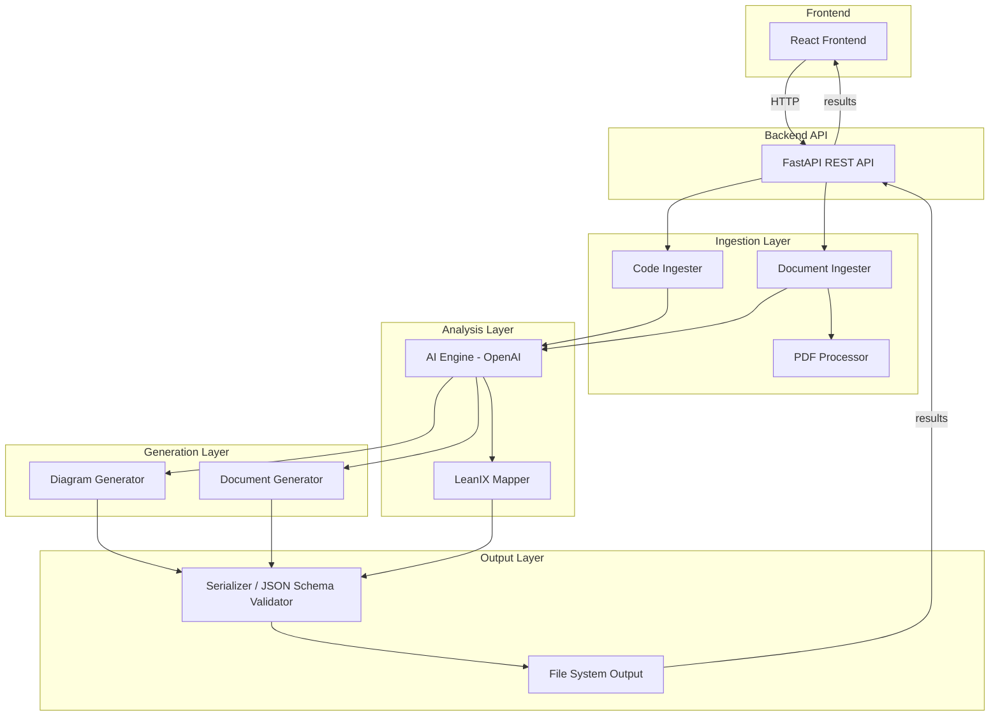

# Design Document: Architectural Reverse Engineer

## Overview

The Architectural Reverse Engineer is a web-based tool that analyzes existing codebases and architectural documents to produce comprehensive, up-to-date architectural documentation. The system accepts source code (local paths or GitHub URLs) and existing documents (PDFs, Word files, images), processes them through an AI-powered analysis pipeline, and generates a suite of outputs: dependency graphs, component diagrams, UML diagrams, lower-level design diagrams, Architectural Decision Records (ADRs), LeanIX object mappings, and Markdown documentation.

The system is composed of a Python backend (FastAPI) handling ingestion, analysis, and generation, an AI integration layer using the OpenAI API, and a React-based frontend for user interaction. All structured outputs are serialized to JSON with schema validation, and all diagrams are produced as both rendered images and structured/source files.

## Architecture

The system follows a layered pipeline architecture:



### Key Architectural Decisions

1. **Python + FastAPI backend**: Chosen for strong ecosystem support for file parsing (PyMuPDF, python-docx), AI integration (openai SDK), and diagram generation (Graphviz, PlantUML).
2. **Pipeline architecture**: Each stage (ingestion → analysis → generation → serialization) is decoupled, allowing independent testing and extension.
3. **OpenAI API for AI analysis**: Leverages GPT-4 vision capabilities for image analysis and text-based reasoning for code/document analysis.
4. **JSON as canonical structured output**: All structured data uses JSON with published JSON Schemas for validation, enabling round-trip serialization.
5. **React frontend**: Provides a responsive SPA for input configuration, progress tracking, and result browsing.

## Components and Interfaces

### 1. Code Ingester (`code_ingester`)

- **Responsibility**: Accept local paths or GitHub URLs, scan/clone repositories, identify source files, parse structure.
- **Interface**:
  - `ingest(source: SourceInput) -> CodebaseModel`: Accepts a local path or GitHub URL, returns a parsed codebase model.
- **Dependencies**: `git` CLI (for cloning), file system access, language-specific parsers.

### 2. Document Ingester (`document_ingester`)

- **Responsibility**: Accept PDF, Word, and image files; extract text and images.
- **Interface**:
  - `ingest(document: DocumentInput) -> DocumentModel`: Accepts a file, returns extracted content.
- **Dependencies**: `PDF_Processor`, `python-docx`, image I/O.

### 3. PDF Processor (`pdf_processor`)

- **Responsibility**: Extract text and embedded images from PDF files.
- **Interface**:
  - `extract(pdf_path: str) -> PdfContent`: Returns extracted text blocks and images.
- **Dependencies**: PyMuPDF (`fitz`).

### 4. AI Engine (`ai_engine`)

- **Responsibility**: Analyze parsed code and documents using OpenAI API; identify patterns, entities, relationships; classify elements.
- **Interface**:
  - `analyze_code(codebase: CodebaseModel) -> AnalysisResult`: Analyze code structure.
  - `analyze_document(document: DocumentModel) -> AnalysisResult`: Analyze document/diagram content.
  - `reconcile(code_analysis: AnalysisResult, doc_analysis: AnalysisResult) -> ReconciledModel`: Merge code and document analyses.
  - `classify_elements(elements: list[Element]) -> list[ClassifiedElement]`: Classify into LeanIX types.
- **Dependencies**: OpenAI API client.

### 5. LeanIX Mapper (`leanix_mapper`)

- **Responsibility**: Map classified elements to LeanIX object types; produce mapping reports with confidence scores and relationships.
- **Interface**:
  - `map(elements: list[ClassifiedElement]) -> LeanIXReport`: Produce JSON mapping report.
- **Dependencies**: AI Engine classification output.

### 6. Diagram Generator (`diagram_generator`)

- **Responsibility**: Produce dependency graphs, component diagrams, UML diagrams, and LLDs.
- **Interface**:
  - `generate_dependency_graph(analysis: ReconciledModel) -> DiagramOutput`
  - `generate_component_diagram(analysis: ReconciledModel) -> DiagramOutput`
  - `generate_uml_class_diagram(analysis: ReconciledModel) -> DiagramOutput`
  - `generate_uml_sequence_diagram(analysis: ReconciledModel) -> DiagramOutput`
  - `generate_lld(component: ComponentModel) -> DiagramOutput`
- **Dependencies**: Graphviz, PlantUML.

### 7. Document Generator (`document_generator`)

- **Responsibility**: Produce ADRs and comprehensive Markdown documentation.
- **Interface**:
  - `generate_adrs(analysis: ReconciledModel, existing_adrs: list[ADR] | None) -> list[ADR]`
  - `generate_markdown(analysis: ReconciledModel, diagrams: list[DiagramOutput]) -> str`
- **Dependencies**: AI Engine, Diagram Generator outputs.

### 8. Serializer (`serializer`)

- **Responsibility**: Serialize all structured outputs to JSON, validate against JSON Schema, support round-trip parsing.
- **Interface**:
  - `serialize(data: StructuredOutput) -> str`: Serialize to JSON string.
  - `deserialize(json_str: str, schema: type) -> StructuredOutput`: Parse JSON back to data structure.
  - `validate(json_str: str, schema_path: str) -> ValidationResult`: Validate against JSON Schema.
- **Dependencies**: `jsonschema` library.

### 9. FastAPI REST API (`api`)

- **Responsibility**: Expose HTTP endpoints for the frontend; orchestrate the pipeline.
- **Interface**:
  - `POST /analyze`: Accept inputs, trigger pipeline, return job ID.
  - `GET /status/{job_id}`: Return current analysis stage.
  - `GET /results/{job_id}`: Return generated outputs.
  - `GET /download/{job_id}/{artifact}`: Download specific output file.
- **Dependencies**: All backend components.

### 10. React Frontend (`frontend`)

- **Responsibility**: Provide web UI for input configuration, progress display, result browsing, and downloads.
- **Dependencies**: REST API.


## Data Models

### SourceInput

```python
class SourceInput(BaseModel):
    input_type: Literal["local_path", "github_url"]
    value: str  # file path or URL
```

### DocumentInput

```python
class DocumentInput(BaseModel):
    file_path: str
    file_type: Literal["pdf", "docx", "png", "jpg", "svg"]
```

### CodebaseModel

```python
class SourceFile(BaseModel):
    path: str
    language: str
    imports: list[str]
    exports: list[str]
    public_interfaces: list[str]

class CodebaseModel(BaseModel):
    root_path: str
    files: list[SourceFile]
    module_boundaries: list[ModuleBoundary]
```

### ModuleBoundary

```python
class ModuleBoundary(BaseModel):
    name: str
    files: list[str]
    dependencies: list[str]  # names of other modules
```

### PdfContent

```python
class PdfContent(BaseModel):
    text_blocks: list[str]
    images: list[bytes]
```

### DocumentModel

```python
class DocumentModel(BaseModel):
    source_path: str
    file_type: str
    text_content: list[str]
    images: list[bytes]
```

### AnalysisResult

```python
class Element(BaseModel):
    name: str
    element_type: str  # e.g., "service", "class", "module", "interface"
    metadata: dict

class Relationship(BaseModel):
    source: str
    target: str
    relationship_type: str  # e.g., "depends_on", "implements", "calls"

class AnalysisResult(BaseModel):
    elements: list[Element]
    relationships: list[Relationship]
    patterns: list[str]  # detected architectural patterns
    layers: list[str]    # detected architectural layers
```

### ClassifiedElement

```python
class ClassifiedElement(BaseModel):
    element: Element
    leanix_type: str  # "Organization", "Interface", "Data Object", "IT Component", or custom
    confidence: float  # 0.0 to 1.0
    alternative_types: list[dict]  # [{type: str, confidence: float}]
    evidence: list[str]
```

### ReconciledModel

```python
class ReconciledModel(BaseModel):
    elements: list[ClassifiedElement]
    relationships: list[Relationship]
    patterns: list[str]
    layers: list[str]
    discrepancies: list[str]  # differences between code and docs
```

### LeanIXReport

```python
class LeanIXMapping(BaseModel):
    element_name: str
    leanix_types: list[dict]  # [{type: str, confidence: float}]
    evidence: list[str]
    relationships: list[dict]  # [{target: str, relationship: str}]

class LeanIXReport(BaseModel):
    mappings: list[LeanIXMapping]
```

### DiagramOutput

```python
class DiagramOutput(BaseModel):
    diagram_type: str  # "dependency_graph", "component", "uml_class", "uml_sequence", "lld"
    rendered_image: bytes  # PNG or SVG
    image_format: Literal["png", "svg"]
    structured_data: dict  # JSON-serializable graph data
    source_file: str | None  # PlantUML source for UML diagrams
```

### ADR

```python
class ADR(BaseModel):
    title: str
    status: str  # "Proposed", "Accepted", "Deprecated", "Superseded"
    context: str
    decision: str
    consequences: str
```

### StructuredOutput

```python
class StructuredOutput(BaseModel):
    """Union type for all JSON-serializable outputs."""
    output_type: str
    data: dict  # The actual structured data
```

### ValidationResult

```python
class ValidationResult(BaseModel):
    valid: bool
    errors: list[str]
```


## Correctness Properties

*A property is a characteristic or behavior that should hold true across all valid executions of a system — essentially, a formal statement about what the system should do. Properties serve as the bridge between human-readable specifications and machine-verifiable correctness guarantees.*

### Property 1: Recursive file discovery completeness

*For any* valid local directory tree containing source code files at arbitrary nesting depths, the Code Ingester should return a set of identified source files that exactly matches the set of actual source code files in the directory tree.

**Validates: Requirements 1.1**

### Property 2: Invalid source input error reporting

*For any* invalid source input (non-existent local path, inaccessible path, malformed GitHub URL, or unreachable URL), the Analyzer should return an error result containing a descriptive message that identifies the nature of the problem.

**Validates: Requirements 1.3, 1.4**

### Property 3: Source file parsing completeness

*For any* set of identified source code files, the Analyzer should produce a CodebaseModel where every file has a corresponding entry with non-empty file structure, and all import/export relationships present in the source are captured.

**Validates: Requirements 1.5**

### Property 4: PDF text and image extraction round-trip

*For any* programmatically generated PDF containing known text blocks and embedded images, the PDF Processor should extract text content that contains all the original text blocks and image data that matches the original embedded images.

**Validates: Requirements 2.1**

### Property 5: Word document text and image extraction round-trip

*For any* programmatically generated Word document containing known text paragraphs and embedded images, the Analyzer should extract text content that contains all the original paragraphs and image data that matches the original embedded images.

**Validates: Requirements 2.2**

### Property 6: Unsupported file type error includes supported types list

*For any* file with an extension not in the supported set (pdf, docx, png, jpg, svg), the Analyzer should return an error that lists all supported file types.

**Validates: Requirements 2.4**

### Property 7: LeanIX classification validity

*For any* list of discovered architectural elements, every classified element should have a `leanix_type` that is one of: "Organization", "Interface", "Data Object", "IT Component", or a recognized custom LeanIX type. Elements with confidence below the threshold should be flagged as "unclassified".

**Validates: Requirements 3.4, 3.5, 9.1**

### Property 8: Dependency graph structural correctness

*For any* reconciled analysis model containing module dependencies, the generated dependency graph's structured data should contain a node for every module and a directed edge (source → target) for every dependency relationship, with no missing or extra edges.

**Validates: Requirements 4.1, 4.2**

### Property 9: Circular dependency highlighting

*For any* dependency graph containing at least one cycle, the Diagram Generator should mark all edges and nodes participating in circular dependency paths as highlighted in the structured output.

**Validates: Requirements 4.3**

### Property 10: Diagram dual output format

*For any* diagram generation (dependency graph, component diagram, UML diagram, or LLD), the output should contain both a non-empty rendered image (PNG or SVG) and a non-empty structured data file (JSON) or source file (PlantUML for UML diagrams).

**Validates: Requirements 4.4, 5.4, 6.4, 7.3**

### Property 11: Component diagram labeling completeness

*For any* component in a generated component diagram, the component node should be labeled with its name, type, and associated LeanIX object type. Every inter-component relationship should have a labeled connector indicating the interface type.

**Validates: Requirements 5.1, 5.2, 5.3**

### Property 12: UML class diagram coverage

*For any* reconciled analysis model containing object-oriented structures (classes with inheritance, composition, or association), the Diagram Generator should produce a UML class diagram containing a class node for each identified OO structure.

**Validates: Requirements 6.1**

### Property 13: UML sequence diagram coverage

*For any* reconciled analysis model containing service interaction flows, the Diagram Generator should produce at least one UML sequence diagram representing those interactions.

**Validates: Requirements 6.2**

### Property 14: LLD internal structure coverage

*For any* analyzed component with internal classes, functions, and data transformations, the generated LLD should contain labeled nodes for each internal element and data transformation step.

**Validates: Requirements 7.1, 7.2**

### Property 15: ADR structural completeness

*For any* generated ADR, the output should be valid Markdown containing all five required sections: Title, Status, Context, Decision, and Consequences.

**Validates: Requirements 8.1, 8.2, 8.3**

### Property 16: ADR deduplication against existing set

*For any* set of existing ADRs and a set of newly detected architectural decisions, the Document Generator should produce ADRs only for decisions not already covered by the existing set. The intersection of existing ADR topics and newly generated ADR topics should be empty.

**Validates: Requirements 8.4**

### Property 17: LeanIX mapping report completeness

*For any* set of classified elements, the LeanIX mapping report should contain an entry for every element with its classification, non-empty evidence, and relationship mappings. Elements with multiple applicable types should list them in descending order of confidence score.

**Validates: Requirements 9.2, 9.3, 9.4**

### Property 18: Markdown documentation section completeness

*For any* generated Markdown document, it should contain a table of contents and all four required sections (system overview, component descriptions, dependency summary, interface catalog), with the TOC containing links that correspond to each section. Every generated diagram should be embedded or linked within the document.

**Validates: Requirements 10.1, 10.2, 10.3**

### Property 19: JSON serialization round-trip

*For any* valid structured output (dependency graph, component map, LeanIX mapping, or any StructuredOutput), serializing to JSON and then deserializing back should produce a data structure equivalent to the original.

**Validates: Requirements 12.1, 12.2, 12.3**

### Property 20: JSON Schema validation before write

*For any* structured output serialized to JSON, the output should pass validation against the published JSON Schema for its output type before being written to disk.

**Validates: Requirements 12.4**


## Error Handling

### Input Validation Errors

| Error Condition | Component | Response |
|---|---|---|
| Invalid local path (non-existent, no permissions) | Code Ingester | `InputError` with descriptive message identifying the path and reason |
| Invalid GitHub URL (malformed, unreachable) | Code Ingester | `InputError` with descriptive message identifying the URL and reason |
| Unsupported file type | Document Ingester | `UnsupportedFileError` listing all supported types |
| Corrupted/unreadable file | Document Ingester / PDF Processor | `FileReadError` identifying the problematic file |
| Empty input (no source or documents provided) | API | `ValidationError` requiring at least one input |

### Processing Errors

| Error Condition | Component | Response |
|---|---|---|
| Git clone failure | Code Ingester | `GitError` with clone stderr output |
| PDF extraction failure | PDF Processor | `ExtractionError` with file path and PyMuPDF error |
| OpenAI API failure (rate limit, timeout, auth) | AI Engine | `AIServiceError` with retry guidance and original error |
| Diagram rendering failure (Graphviz/PlantUML) | Diagram Generator | `RenderError` with tool stderr and fallback to structured-data-only output |
| JSON Schema validation failure | Serializer | `SchemaValidationError` with list of validation errors |

### Error Propagation Strategy

- All errors are wrapped in a typed error hierarchy (`AnalyzerError` base class).
- Errors propagate up through the pipeline to the API layer.
- The API returns structured JSON error responses with `error_type`, `message`, and `details` fields.
- The frontend displays the `message` field to the user.
- Non-fatal errors (e.g., one file fails to parse) are collected and reported alongside partial results.

## Testing Strategy

### Unit Testing

Unit tests cover specific examples, edge cases, and error conditions:

- **Code Ingester**: Test with known directory structures; verify file discovery for specific languages; test error cases (missing dirs, permission errors).
- **Document Ingester**: Test PDF/Word extraction with known sample files; test unsupported file type rejection; test corrupted file handling.
- **AI Engine**: Test classification output format with mocked AI responses; test confidence threshold logic.
- **Diagram Generator**: Test graph construction from known analysis models; test circular dependency detection with specific graph topologies.
- **Document Generator**: Test ADR structure with known inputs; test Markdown TOC generation; test ADR deduplication with overlapping sets.
- **LeanIX Mapper**: Test mapping report structure; test confidence ranking order; test relationship inclusion.
- **Serializer**: Test JSON output validity; test schema validation with known valid/invalid inputs.
- **API**: Test endpoint responses for success and error cases; test progress reporting.
- **Frontend**: Test input field rendering; test progress indicator state changes; test error display.

Unit tests should focus on concrete examples and edge cases. Avoid writing excessive unit tests for scenarios better covered by property tests.

### Property-Based Testing

Property-based tests verify universal properties across randomly generated inputs. The project will use **Hypothesis** (Python) as the property-based testing library.

Each property test:
- Runs a minimum of **100 iterations** per property
- References its design document property with a comment tag
- Tag format: `# Feature: architectural-reverse-engineer, Property {number}: {property_text}`

Property tests to implement (one test per correctness property):

1. **Property 1**: Generate random directory trees with source files → verify complete discovery.
2. **Property 2**: Generate random invalid paths/URLs → verify descriptive error returned.
3. **Property 3**: Generate random source file sets → verify CodebaseModel completeness.
4. **Property 4**: Generate random PDFs with known content → verify extraction matches.
5. **Property 5**: Generate random Word docs with known content → verify extraction matches.
6. **Property 6**: Generate random unsupported extensions → verify error lists supported types.
7. **Property 7**: Generate random element lists → verify LeanIX type validity and unclassified flagging.
8. **Property 8**: Generate random dependency models → verify graph node/edge correctness.
9. **Property 9**: Generate random graphs with cycles → verify cycle highlighting.
10. **Property 10**: Generate random analysis models → verify dual output (image + structured data).
11. **Property 11**: Generate random component models → verify label completeness and connector labels.
12. **Property 12**: Generate random OO structures → verify UML class diagram coverage.
13. **Property 13**: Generate random service interactions → verify sequence diagram production.
14. **Property 14**: Generate random component internals → verify LLD node coverage.
15. **Property 15**: Generate random detected decisions → verify ADR Markdown structure.
16. **Property 16**: Generate random existing + new ADR sets → verify no overlap in generated ADRs.
17. **Property 17**: Generate random classified elements → verify report completeness and confidence ordering.
18. **Property 18**: Generate random analysis results with diagrams → verify Markdown section and diagram coverage.
19. **Property 19**: Generate random StructuredOutput instances → verify serialize/deserialize round-trip equivalence.
20. **Property 20**: Generate random structured outputs → verify JSON Schema validation passes.

### Testing Tools

| Tool | Purpose |
|---|---|
| **pytest** | Test runner and unit test framework |
| **Hypothesis** | Property-based testing library for Python |
| **pytest-cov** | Code coverage reporting |
| **unittest.mock** | Mocking external dependencies (OpenAI API, git CLI, file system) |
| **React Testing Library** | Frontend component testing |
| **Jest** | Frontend test runner |

### Test Organization

```
tests/
├── unit/
│   ├── test_code_ingester.py
│   ├── test_document_ingester.py
│   ├── test_pdf_processor.py
│   ├── test_ai_engine.py
│   ├── test_diagram_generator.py
│   ├── test_document_generator.py
│   ├── test_leanix_mapper.py
│   ├── test_serializer.py
│   └── test_api.py
├── property/
│   ├── test_file_discovery_props.py
│   ├── test_ingestion_props.py
│   ├── test_classification_props.py
│   ├── test_diagram_props.py
│   ├── test_document_props.py
│   ├── test_leanix_props.py
│   ├── test_serialization_props.py
│   └── test_markdown_props.py
└── frontend/
    ├── InputFields.test.tsx
    ├── ProgressIndicator.test.tsx
    └── ResultsDisplay.test.tsx
```
